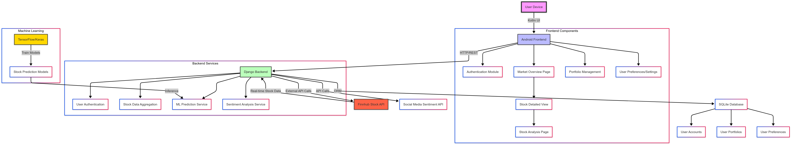

# Stock Insights: A Stock Analysis Mobile Application

## Project Overview

Stock Insight is a comprehensive Android application designed to provide users with in-depth stock market analysis, leveraging stock prediction ML models to deliver intelligent investment insights.

### Key Features

#### 1. Market Overview
- Real-time display of top market stocks
- Quick access to stock information
- Intuitive list view of market performance

#### 2. Detailed Stock Analysis
- Comprehensive stock information page
- Interactive price change graphs
- Company background and financial metrics
- AI-powered stock prediction

#### 3. Sentiment Analysis
- Integration of social media sentiment
- Market trend analysis
- Contextual stock recommendations

#### 4. Portfolio Management
- Track user's stock portfolio
- Favorite stocks tracking
- Performance visualization

#### 5. User Authentication
- Secure login and registration system
- Profile management
- Personalized user experience

#### 6. User Preferences
- Customizable app settings
- Notification preferences
- Display and data refresh settings

## Technical Architecture

### Frontend
- **Technology**: Kotlin
- **Key Components**:
  - Authentication Module
  - Market Overview Page
  - Stock Detailed View
  - Stock Analysis Page
  - Portfolio Management
  - User Preferences/Settings

### Backend
- **Technology**: Django
- **Services**:
  - User Authentication
  - Stock Data Aggregation
  - Machine Learning Prediction
  - Sentiment Analysis

### Database
- **Technology**: SQLite (Django ORM)
- **Stored Data**:
  - User Accounts
  - User Portfolios
  - User Preferences

### External Integrations
- **Stock Data**: Finnhub Stock API
- **Sentiment Analysis**: Social Media API
- **Machine Learning**: TensorFlow/Keras

### System Architecture

### April 9, UI updates
- **Color Palette**: #8b94a3, #c2eabd, #72a0c1, #555d50, #392511
- **SVG to Vector Asset conversion**:
  - For reference svgs: https://www.svgrepo.com/
  - Download a svg image 
  - In Android Studio, go to Files
  - Create New -> Vector Assets
  - Specs: 24dp to 30dp
  - Change palettes accordingly if required in the converted xml file
